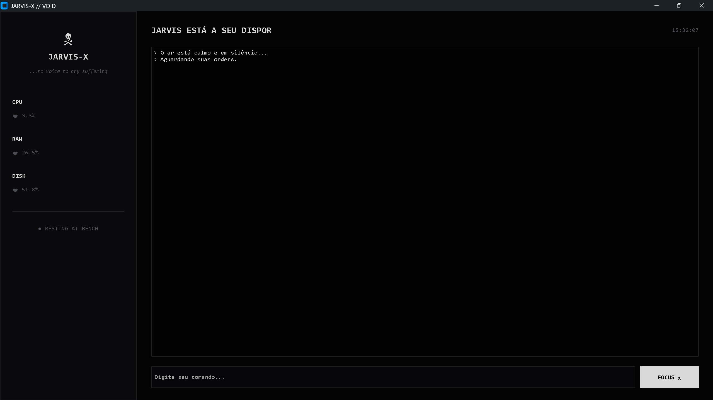

# 🤖 JARVIS-X

## 🖼️ Demonstração do Sistema



Um assistente pessoal desenvolvido em Python com interface gráfica moderna e minimalista usando CustomTkinter.

O objetivo do projeto é simular um sistema operacional assistido por IA, oferecendo monitoramento do computador em tempo real, automação de tarefas e integração com inteligência artificial.

---

## 🔗 Repositório

https://github.com/fabiopy-creator/jarvis

---

## ✨ Funcionalidades

### 🖥️ Monitoramento do Sistema
- Uso de CPU em tempo real
- Uso de RAM em tempo real
- Uso de Disco em tempo real
- Relógio integrado

### 🌐 Automação Web
- Abrir Google
- Abrir YouTube
- Abrir GitHub
- Abrir ChatGPT
- Abrir Spotify
- Abrir Gmail
- Abrir LinkedIn
- Abrir Claude

### ⚙️ Automação do Windows
- Abrir Notepad
- Abrir Calculadora
- Abrir Explorer
- Abrir CMD
- Abrir Paint
- Abrir Gerenciador de Tarefas

### 📂 Organização de Arquivos
- Organiza automaticamente as pastas **Downloads** e **Área de Trabalho (Desktop)**
- Separa arquivos por categoria:
  - Imagens
  - Vídeos
  - Documentos
  - Programas
  - Código
  - Compactados

### 🗃️ Histórico
- Armazenamento em SQLite
- Registro de comandos executados
- Consulta dos últimos comandos

### 🧠 Inteligência Artificial
- Integração com Anthropic Claude
- Respostas diretamente pela interface
- Execução assíncrona para não travar a aplicação

---

## 📸 Interface

O projeto possui uma interface inspirada em uma estética monocromática e melancólica (Void / Hollow Knight):

- Tema escuro e minimalista em preto e branco osso
- Painel lateral de monitoramento direto (CPU, RAM, DISK)
- Terminal integrado limpo
- Status em tempo real
- Layout retilíneo sem cantos arredondados

---

## 🚀 Instalação

### 1. Clone o repositório

```bash
git clone [https://github.com/fabiopy-creator/jarvis.git](https://github.com/fabiopy-creator/jarvis.git)
